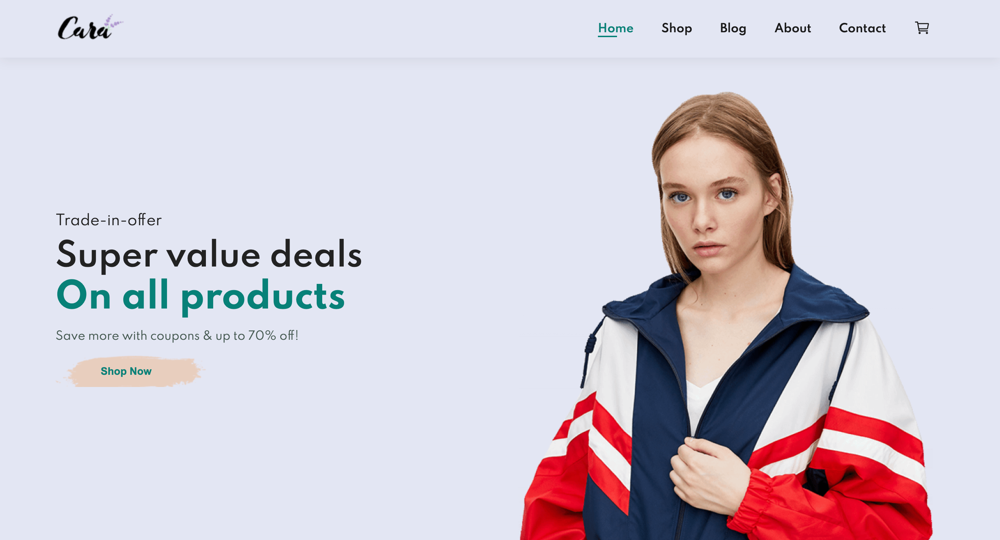

# Cara Clothing | Roupas e Acessórios

## Overview

Cara Clothing is a responsive e-commerce interface I built using HTML and CSS at the beginning of my programming journey. It was a simple project that helped me practice and strengthen my foundational web development skills, especially in structuring layouts and styling pages.

[View Project](https://ecommerce-cara-clothing.vercel.app/)

## :man_mechanic: Languages and Tools

- HTML
- CSS

## :paintbrush: Layout

### :desktop_computer: Desktop



### :iphone: Mobile


## :computer: Dependencies

```shell
# 1. Clone the project

git clone https://github.com/dev-andreola/ecommerce

# 2. Run live server
```

## :triangular_flag_on_post: Contribute to the project

Any contributions you make are **greatly appreciated**.

If you have any corrections or improvements that would make this better, please fork the repo and create a pull request.

1. Fork the Project
2. Create your Feature Branch (`git checkout -b feature/Feature`)
3. Commit your Changes (`git commit -m 'Add some Feature'`)
4. Push to the Branch (`git push origin feature/Feature`)
5. Open a Pull Request
